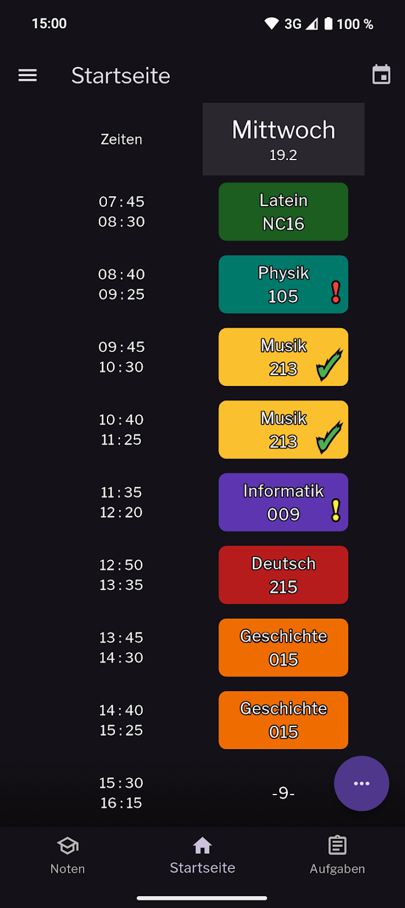
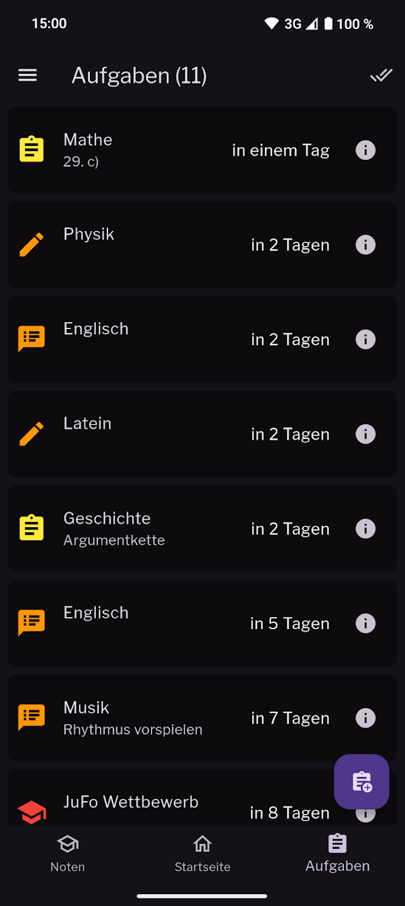
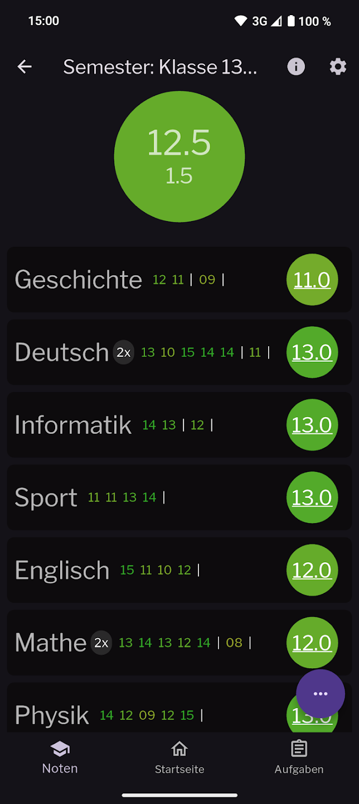

# 📚 Schulapp – Die perfekte Organisation für deinen Schulalltag!

Willkommen im offiziellen Repository der **Schulapp**!  
Mit der Schulapp hast du alles, was du für deinen Schulalltag brauchst – modern, intuitiv und komplett kostenlos.
Entwickelt **von Schülern für Schüler**, unterstützt dich die Schulapp dabei, organisiert und stressfreier durch den Schulalltag zu kommen – egal ob Stundenplan, Noten oder Hausaufgaben.

---

## 🚀 Features

<table>
  <tr>
    <td align="center" width="50%">
      <h4>🔹 Übersichtlicher Stundenplan (Wochen- oder Tagesansicht)</h4>
      Sieh sofort deinen aktuellen Tag, teile deinen Plan mit Freund*innen und verwalte A-/B-Wochen. 
      
    </td>
    <td width="50%">
      <h4>🔹 Intelligenter Aufgaben-Manager</h4>
      Plane Hausaufgaben, Tests und Klausuren mit automatischen Erinnerungen. 
      
    </td>
  </tr>
  <tr>
    <td>
      <h4>🔹 Notenverwaltung & Durchschnitt</h4>
      Behalte deine Noten im Blick – inkl. Notengewichtung und Statistiken. 
      
    </td>
    <td>
      <h4>🔹 Notizen & Anhänge</h4>
      Speichere wichtige Infos als Text, Bild oder PDF – direkt an Fächer oder Aufgaben gebunden. 
      
    </td>
  </tr>
  <tr>
    <td>
      <h4>🔹 Ferien & Feiertage</h4>
      Automatische Anzeige je nach Bundesland.  
      
    </td>
    <td>
      <h4>🔹 Individuelle Anpassungen</h4>
      Wähle zwischen hell/dunkel, verschiedenen Notensystemen u. v. m. 
      
    </td>
  </tr>
  <tr>
    <td colspan="2" align="center">
      <h4>🔹 Android Homescreen-Widget</h4>
      Dein aktueller Stundenplan – direkt auf dem Homescreen. 
      
    </td>
  </tr>
</table>

---

## 📱 Verfügbarkeit

Die Schulapp ist kostenlos erhältlich für:

- [📲 Android (Google Play Store)](https://play.google.com/store/apps/details?id=com.flologames.schulapp)  
- [🍏 iOS (Apple App Store)](https://apps.apple.com/de/app/schulapp-dein-schulbegleiter/id6743677720)
- [🪟 Windows (siehe GitHub Releases)](https://github.com/FloloGames/schulapp/releases)

---

## 📄 Lizenz

Dieses Projekt steht unter der **GNU Affero General Public License** – siehe [`LICENSE`](./LICENSE) für weitere Informationen.

---

## 🙌 Mitmachen

Wenn du zur Schulapp beitragen möchtest:
1. installiere [flutter](https://flutter.dev) 
2. Forke das Repository
3. Erstelle einen Branch (`git checkout -b feature/mein-feature`)
4. Committe deine Änderungen (`git commit -am 'Neues Feature'`)
5. Push zum Branch (`git push origin feature/mein-feature`)
6. Stelle einen Pull Request

---

## 📬 Kontakt

Bei Fragen, Feedback oder Ideen erreichst du uns direkt über GitHub oder per E-Mail an **schulapp.feedback@gmail.com**.

---

**👉 Lade dir jetzt die Schulapp herunter, organisiere deinen Schulalltag smarter – und teile sie mit deinen Freund*innen :)**
